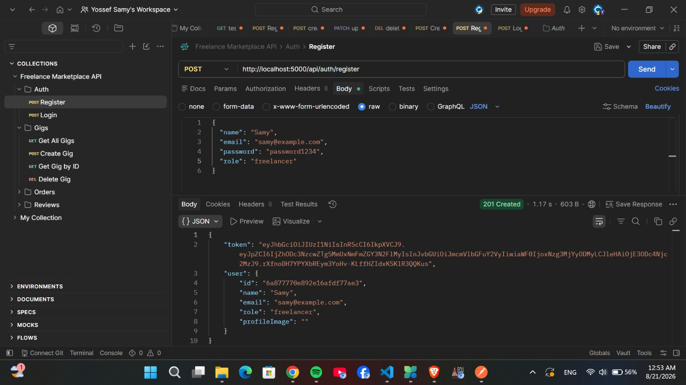
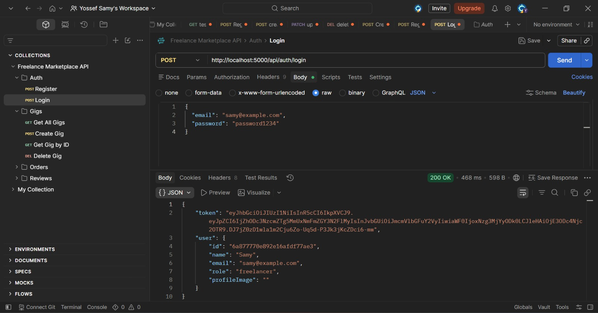
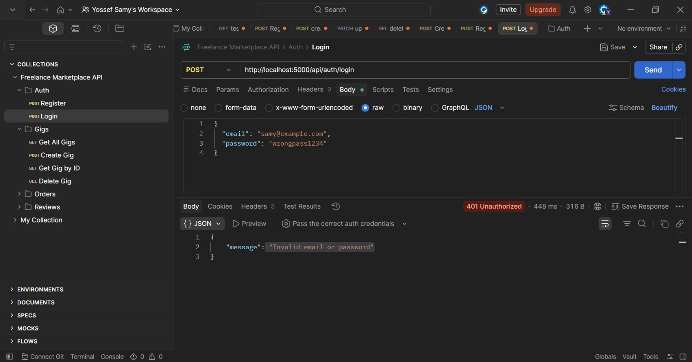
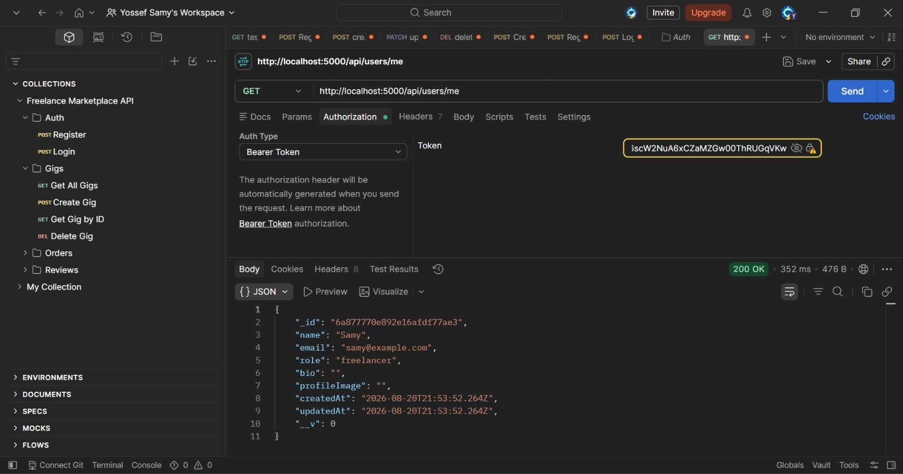
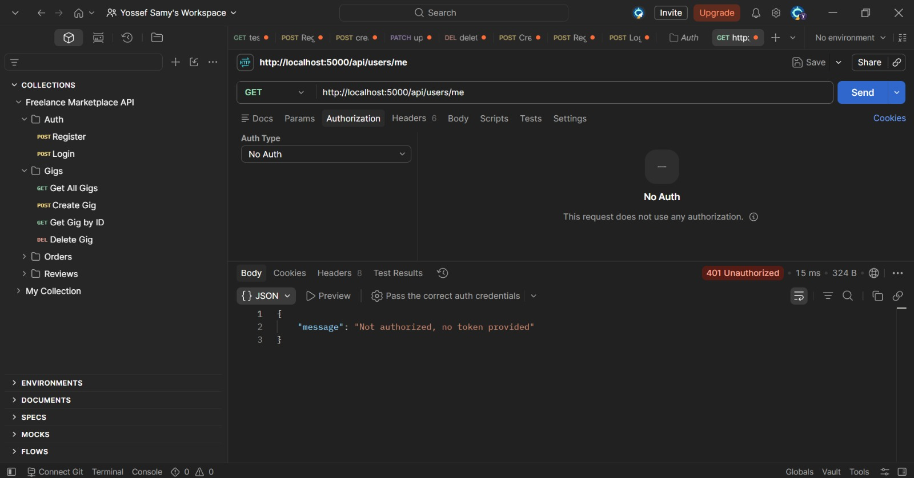

# Freelance Marketplace — Backend (Auth Module)

## What This Module Does
This is the authentication system for the graduation project (a freelance services
marketplace). It handles user registration, login, password hashing, JWT token
generation, and route protection using middleware.

## User Roles
- **freelancer** — can create/edit/delete gigs, update order status
- **client** — can order gigs, update order status to completed, leave reviews

## Setup Instructions
1. `cd backend`
2. `npm install`
3. Copy `.env.example` to `.env` and fill in your MongoDB Atlas URI and a JWT secret
4. `npm start` (or `npm run dev` with nodemon)
5. Server runs at `http://localhost:5000`

## Auth Routes

| Method | Route                | Description                          |
|--------|----------------------|---------------------------------------|
| POST   | /api/auth/register    | Register a new user, returns JWT token |
| POST   | /api/auth/login        | Login with email/password, returns JWT |
| GET    | /api/users/me            | Protected route — get logged-in user's profile |

### Register — Example Request

## Authentication Test Screenshots

### 1. Register Success (201 Created)

### 2. Login Success (200 OK + Token)

### 3. Login Failed (401 Unauthorized)

### 4. Get Current User - Authorized (200 OK)

### 5. Get Current User - Unauthorized (401 Missing Token)

